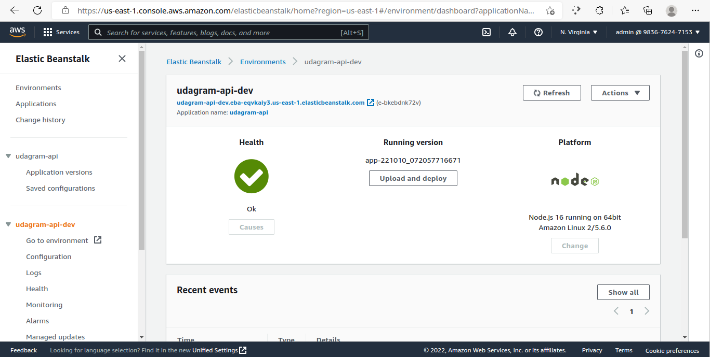
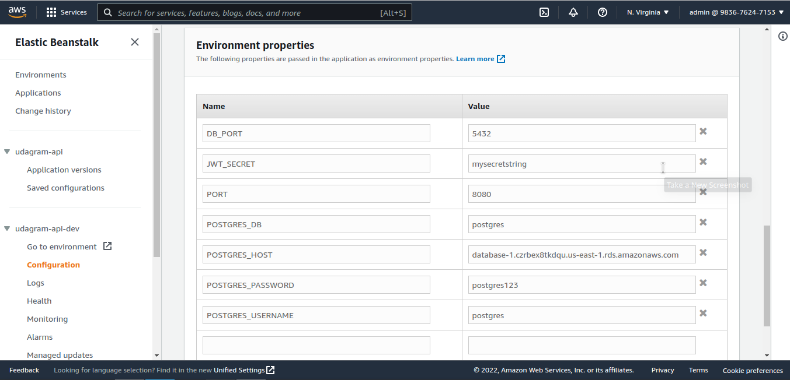

- navigate to ` /udagram/udagram-api`
- run: `eb init`

```shell
/udagram/udagram-api$ eb init -i
Select a default region
1) us-east-1 : US East (N. Virginia)
2) us-west-1 : US West (N. California)
3) us-west-2 : US West (Oregon)
4) eu-west-1 : Europe (Ireland)
5) eu-central-1 : Europe (Frankfurt)
6) ap-south-1 : Asia Pacific (Mumbai)
7) ap-southeast-1 : Asia Pacific (Singapore)
(default is 3): 1

Select an application to use
1) sample_app
2) [ Create new Application ]
(default is 1): 1

Enter Application Name
(default is "udagram-api"): udagram-api
Application tmp has been created.

It appears you are using Node.js Is this correct?
(y/n): y

Select a platform branch.
1) Node.js 16 running on 64bit Amazon Linux 2
2) Node.js 14 running on 64bit Amazon Linux 2
(default is 1): 1
```

- then `eb create --sample udagram-api-dev`

```shell
/udagram/udagram-api$ eb create --sample udagram-api-dev
Environment details for: udagram-api-dev
  Application name: udagram-api
  Region: us-east-1
  Deployed Version: Sample Application
  Environment ID: e-bkebdnk72v
  Platform: arn:aws:elasticbeanstalk:us-east-1::platform/Node.js 16 running on 64bit Amazon Linux 2/5.6.0


```

## now we create udagram-api-dev enviroment with udagram-api application

## 

## set environment variable in Elastic Beanstalk

> Elastic Beanstalk > Environments > udagram-api-dev > Configuration


\* replace asterisks in JWT_SECRET and POSTGRES_PASSWORD fields by your own values
