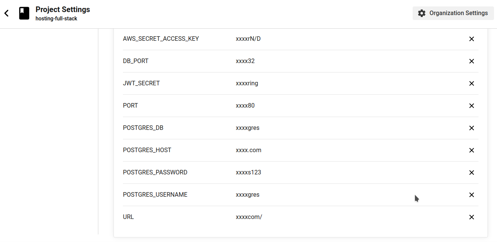

- create `.circleci` directory in project root directory
- create `.circleci/config.yml` file
- use the following orbs
  - circleci/node@5.0.2
  - circleci/aws-elastic-beanstalk@2.0.1
  - circleci/aws-cli@3.1.1
- use docker image

  ```
    docker:
    - image: "cimg/node:14.15"
  ```

- build pipeline by using package.json scripts.
  - Install Front-End Dependencies `npm run frontend:install`
  - Front-End Build `npm run frontend:build`
  - Install API Dependencies `npm run api:install`
  - API Build `npm run api:build`
  - Front-End Deploy ` npm run frontend:deploy`
  - Back-End Deploy `npm run api:deploy`
  ***
- Singup in CircleCi using your GitHub account
- open **projects** and select the repository of this project
  
- Add environment variables 
  - AWS_ACCESS_KEY_ID.
  - AWS_DEFAULT_REGION.
  - AWS_SECRET_ACCESS_KEY.
  - POSTGRES_USERNAME, HOST, DB, PORT and other variables.
  

- now CircleCi can run pipeLine successfully
  
