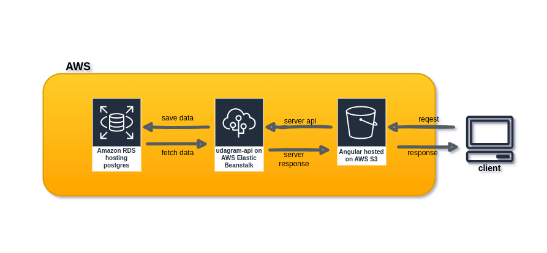
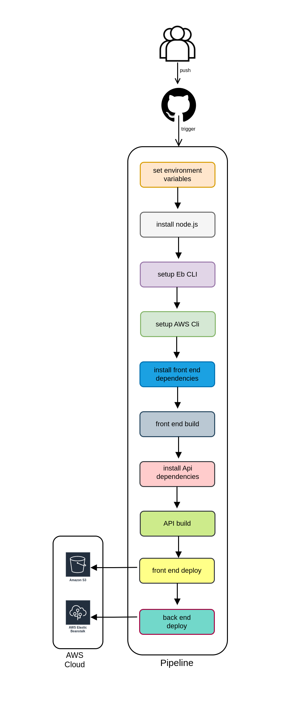

# Hosting a Full-Stack Application
# Udagram
> This application is provided by udacity. The udagram application is a fairly simple application that includes all the major components of a Full-Stack web application.

## prerequisite
- Node v14.15.1 (LTS) or more recent.
- npm 6.14.8 (LTS) or more recent.
- AWS CLI v2.
- EB CLI.

## SETUP OF AWS
1. In AWS, provision a s3 bucket for hosting the uploaded files [Docs/S3](./Docs/S3.md).
2. In AWS, provision a publicly available RDS database running Postgres [Docs/RDS](./Docs/RDS.md).
3. Using Eb Cli, provision a Elastic Beanstalk for Backend [Docs/Eb](./Docs/Eb.md).

## Pipeline & CircleCi
- **Status**: 
- [read doc...](./Docs/Pipeline&CircleCi.md)

## Diagram
- Infrastructure
- Pipeline

## Open S3 Endpoint (Frontend):
- http://udagramstatics.s3-website-us-east-1.amazonaws.com/

## Built With
- [Angular](https://angular.io/) - Single Page Application Framework
- [Node](https://nodejs.org) - Javascript Runtime
- [Express](https://expressjs.com/) - Javascript API Framework

## License
[License](LICENSE.txt)
